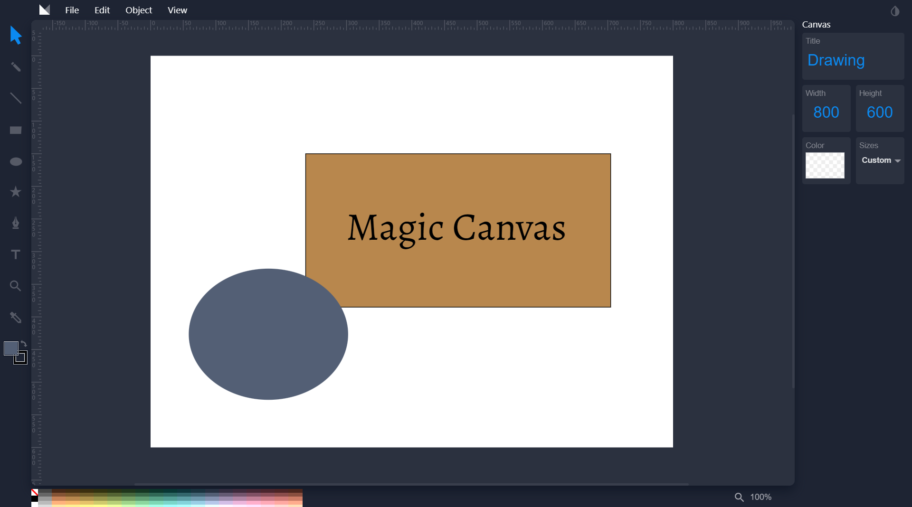

# Magic Canvas

Magic Canvas is a web based vector drawing application. The purpose of Magic Canvas is to provide a simple and easy-to-use SVG editor experience. It purposely removes some features such as layers and line-caps/corners in exchange for a more simple and pleasant experience.

## Online sync and sharing

Cloud sync and sharing are available on Magic Canvas for Deta.

[](https://deta.space/discovery/method-draw?ref=method.ac)

#### [Try Magic Canvas](https://aishtomer.github.io/MagicCanvas/) online.



## Development

Develop and run a local web server under `src`;

```
cd src
python -m SimpleHTTPServer 8000
```

or if you have Python 3: 

```
cd src
python -m http.server 8000
```

## Build

Install dev dependencies:

`npm install`

Then you can build into `dist` by running:

`gulp build`

Deploy `dist` to your static file server of choice.


Published under an MIT License. Enjoy.
